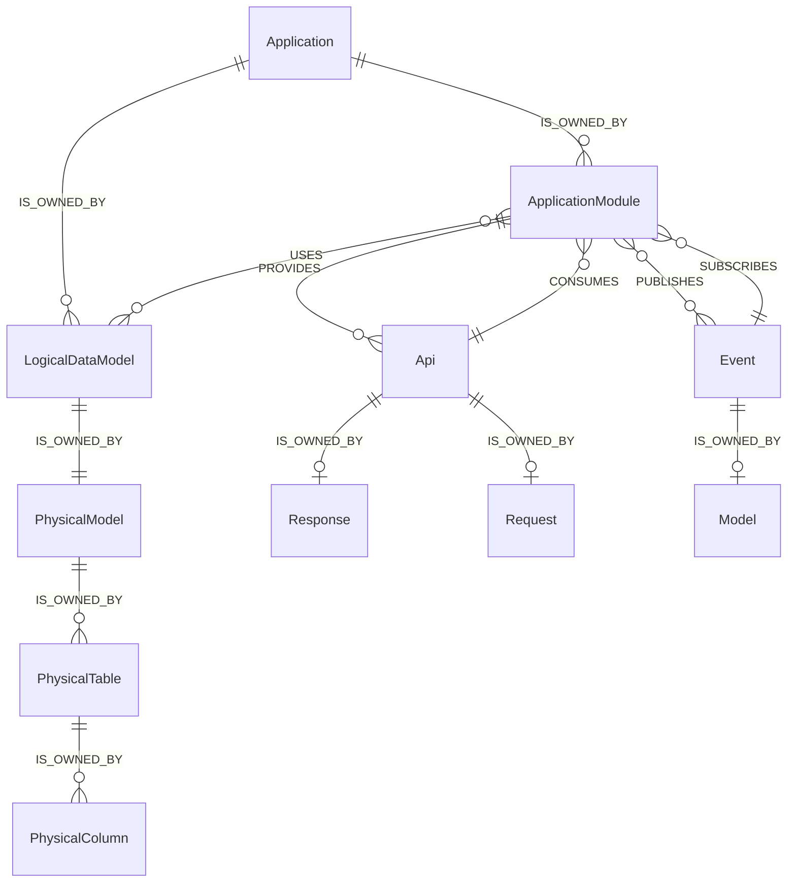
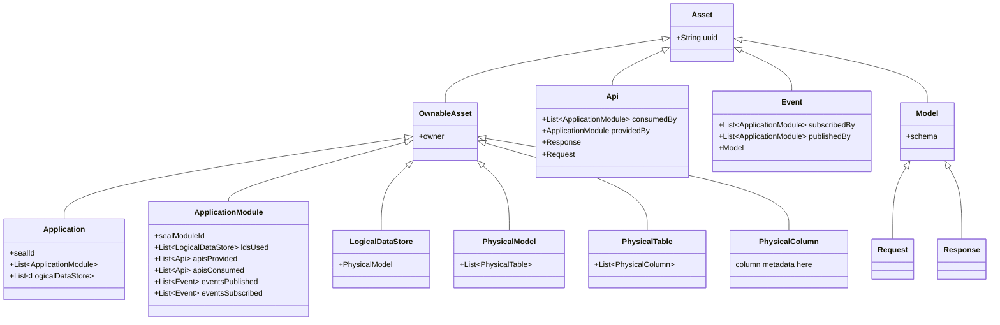

Updated: Feb 2021

### Introduction

The point of `fabric-envoy` (one of many ApplicationModules) is to model JPMC's:
- <b>DIP (Data in Place)</b> - the data stored in all databases
- <b>DIM (Data in Motion)</b> - the data exposed via APIs, Events, and Files

ApplicationModules uses DIP, and exposes it via DIM to other ApplicationModules

# Knowledge Graph
To model DIP, DIM, and the relationships between ApplicationModules we use Neo4j to store its metadata. <b>NOTE: we do NOT store the raw data, but the metadata</b>. For example:
- for DIP we store things like: table names, column names, column data types, etc
- for DIM we store things like: API's response and request models, etc

### ER Diagram of Knowledge Graph
below is an ER Diagram of our Knowledge Graph 

The DIP metadata are modeled with entities falling under `LogicalDataModel`:
- `PhysicalModel`
- `PhysicalTable`
- `PhysicalColumn`

The DIM metadata are modeled with entities falling under `ApplicationModule`:
- `Api`
- `Event`
- `Response`
- `Request`
- `Model`

Since we are using an Object-Oriented Language, each of these entities have a one-to-one correspondence with a class under the `model` package

### Class Diagram of Knowledge Graph
